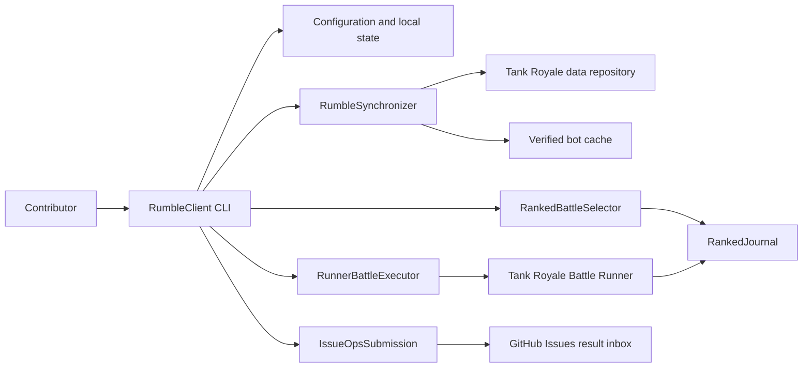

# Architecture

The Rumble Client is a Java 17 command-line application packaged as a container image that is published to GHCR and run by default from there; building it locally, or running it through Gradle, remains possible for development. It coordinates local battle execution between the Tank Royale Battle Runner and the shared Rumble data repositories.

## Boundaries and actors

- Contributors provide a JSON configuration, local state storage, and an optional GitHub token for result submission.
- The Tank Royale data repository supplies the canonical client configuration, engine pin, ranked catalog, matchmaking advice, and bot source archives.
- The Battle Runner executes the selected bots and produces battle and replay output; the client consumes its published 1.3.1 Maven artifact. Container builds also check out the pinned Tank Royale source to package the matching Python API and schema and to build sample bots for smoke verification.
- GitHub Issues provide the result inbox and receipt comments used by submission reconciliation.
- Docker or Podman supplies the isolated multi-runtime environment for reviewed bot code; the host launcher scripts enforce read-only mounts, dropped capabilities, and resource limits.
- GHCR (`ghcr.io/robocode-dev/rumble-client`) distributes the built image on tagged releases, so contributors need not build it themselves.

## Components

- `RumbleClient` parses command-line modes and coordinates validation, synchronization, battle execution, and submission.
- `ClientConfigurationLoader`, `ClientConfiguration`, and `ClientMode` load and validate the local contract.
- `RumbleSynchronizer`, `RepositoryReader`, `GitRepositoryReader`, `RumbleSnapshotParser`, `SourceTreeHash`, and `BotCachePreparer` resolve the canonical snapshot and prepare an immutable local bot cache.
- `RankedBattleSelector`, `RankedBattleRecord`, `RankedBattleExecution`, and `RankedJournal` select under-sampled matchups and persist battle state and evidence.
- `RunnerBattleExecutor` adapts the selected battle to the Tank Royale Battle Runner.
- `IssueOpsSubmission` and `GitHubIssueOpsTransport` submit pending batches and remove them only after receipt comments confirm acceptance.
- `docker/rumble.sh` and `docker/rumble.ps1` are the supported operational boundary for containerized validation, synchronization, execution, and submission.

Architecture documents describe the system's shape, not individual feature details. Durable choices include Java 17, Gradle, Gson for JSON contracts, the Tank Royale Battle Runner dependency, Docker/Podman isolation for runtime execution, and GHCR as the published-image distribution point (see [ADR-001](../decisions/ADR-001-ghcr-image-publishing-on-tag.md)).

<!-- clue:index:start -->
<!-- clue:index:end -->
