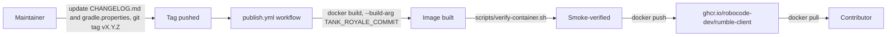

# Design — CAP-001 Published container image

`.github/workflows/publish.yml` triggers only on `push: tags: ['v*.*.*']`, separate from `build.yml`'s existing `docker` job (which builds and smoke-verifies the image on every push/PR but never pushes it anywhere). Both jobs build the same root `Dockerfile` with the same `TANK_ROYALE_COMMIT` build argument read from the `TANK_ROYALE_COMMIT` file, and both run `scripts/verify-container.sh` before the image is trusted; `publish.yml` additionally logs into `ghcr.io` with the workflow's `GITHUB_TOKEN` and pushes the verified image as `ghcr.io/robocode-dev/rumble-client:<version>` and `:latest`.

Versioning is manual (see the repository's `RELEASING.md`): a maintainer edits `CHANGELOG.md`'s `## [Unreleased]` section into a dated version heading, sets the plain (non-`-SNAPSHOT`) version in `gradle.properties`, commits, and pushes a matching `vX.Y.Z` tag. The tag is what the workflow reacts to; `gradle.properties` is not read by CI to decide what to publish.
