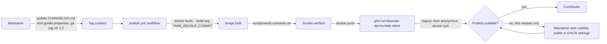

# Design — CAP-001 Published container image

`.github/workflows/publish.yml` triggers only on `push: tags: ['v*.*.*']`, separate from `build.yml`'s existing `docker` job (which builds and smoke-verifies the image on every push/PR but never pushes it anywhere). Both jobs build the same root `Dockerfile` with the same `TANK_ROYALE_COMMIT` build argument read from the `TANK_ROYALE_COMMIT` file, and both run `scripts/verify-container.sh` before the image is trusted; `publish.yml` additionally logs into `ghcr.io` with the workflow's `GITHUB_TOKEN` and pushes the verified image as `ghcr.io/robocode-dev/rumble-client:<version>` and `:latest`.

A package newly created on GHCR via `GITHUB_TOKEN` is not guaranteed to be public, which would silently defeat this capability's purpose (nobody could `docker pull` it without credentials) — and GitHub's API has no operation to set a package's visibility, so the workflow cannot fix this itself. Instead, after pushing, it proves the image is actually usable by logging out, removing the local image, and pulling it back down anonymously; a failure there fails the workflow run loudly rather than leaving a package a contributor cannot use. On the first release this is expected to fail once — `RELEASING.md` documents setting the package to public by hand in its GHCR settings, a one-time step, after which the same check should keep passing on every later release.

On the consuming side, `docker/rumble.sh` and `docker/rumble.ps1` default their image argument to `ghcr.io/robocode-dev/rumble-client:latest`. The container engine pulls it on first use; it does not refresh an already-present `latest`, so contributors re-run `docker pull` to pick up a newer release, or pass a version tag to pin one. A locally built image is used by passing its name as the image argument; CI's smoke check (`scripts/verify-container.sh`) does not go through the launchers and is unaffected by the default.

Versioning is manual (see the repository's `RELEASING.md`): a maintainer edits `CHANGELOG.md`'s `## [Unreleased]` section into a dated version heading, sets the plain (non-`-SNAPSHOT`) version in `gradle.properties`, commits, and pushes a matching `vX.Y.Z` tag. The tag is what the workflow reacts to; `gradle.properties` is not read by CI to decide what to publish.
