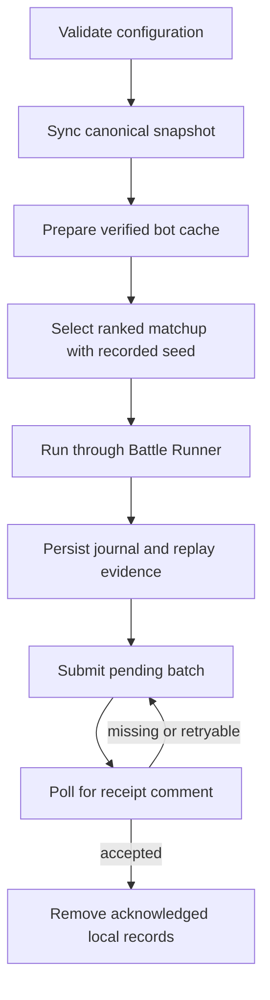

# Design

The client follows a snapshot-first workflow. It validates local configuration, resolves the canonical ranked input snapshot, verifies the engine pin and catalog data, hashes each cached bot source tree against its declared digest, selects a recorded-seed matchup, executes one battle, and persists the result and replay evidence locally before submission.

## Operational flows

Synchronization reads repository contracts and materializes an immutable cache at the catalog's exact source commit. Selection prioritizes under-sampled pairings involving `myBots`, falls back to distinct active catalog entries when advice is unavailable, and records the random seed so the decision can be reproduced. Game-type expansion determines how many catalog entries are required, and selection rejects entries that share a member bot.

Battle execution is delegated to the pinned Tank Royale Battle Runner. The container image carries the supported Java, .NET, Python, and Node.js runtimes; launcher scripts provide the isolation and resource limits needed for reviewed-but-untrusted bot archives. The runtime preflight reports missing prerequisites without installing them.

The local work directory is the durable boundary for the bot cache, journal, and replay evidence. Submission reads pending records, sends batches through the GitHub Issues transport, and retains them until a matching result-data receipt comment is observed. Re-sending an already accepted batch is treated as idempotent, allowing interrupted sessions to resume without knowingly duplicating results.

<!-- clue:index:start -->
<!-- clue:index:end -->
